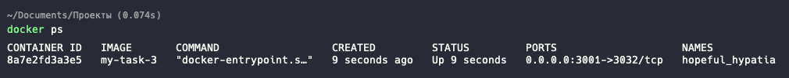
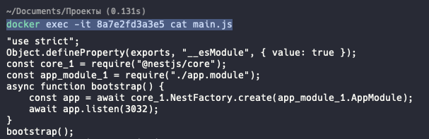
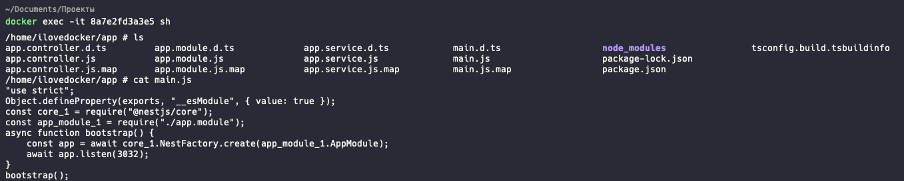
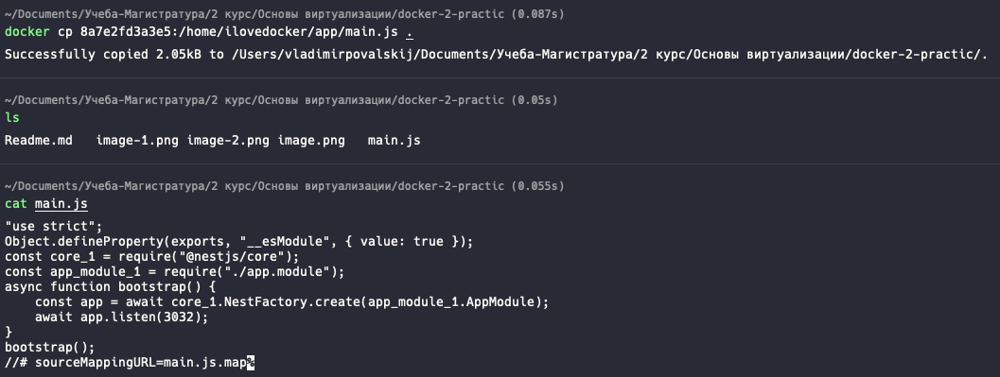

## Сколькими способами можно посмотреть содержимое файла в контейнере
Сделаю на примере своего контейнера. Тут самое главное показать способы просмотра файла в контейнере

Мои контейнеры (Смотреть скриншот 1):   
`docker ps`  
 
CONTAINER ID   IMAGE       COMMAND                  CREATED         STATUS         PORTS                    NAMES  
8a7e2fd3a3e5   my-task-3   "docker-entrypoint.s…"   9 seconds ago   Up 9 seconds   0.0.0.0:3001->3032/tcp   hopeful_hypatia

### 1 Прокинуть в него команду cat.  
`docker exec -it 8a7e2fd3a3e5 cat main.js`  

### 2 Зайти внутрь контейнера и там уже выводить содержимое  
`docker exec -it 8a7e2fd3a3e5 sh`  
`/home/ilovedocker/app # cat main.js`  

### 3 Скопировать файл с контейнера себе локально  
`docker cp 8a7e2fd3a3e5:/home/ilovedocker/app/main.js .`  

